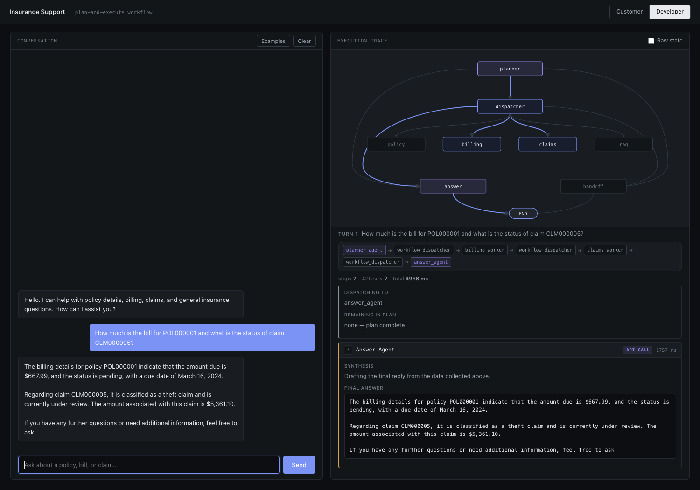
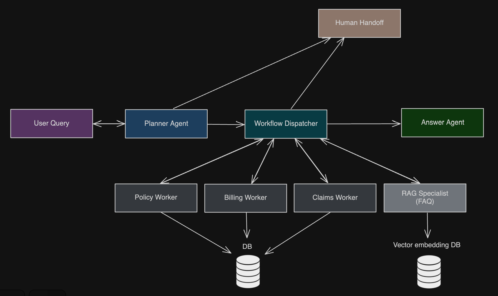

# Insurance Support System

A customer support system for an insurance company, built with LangGraph. You ask it something like
"how much is the bill for POL000001 and what's the status of claim CLM000005", and it works out
which lookups it needs, runs them one at a time, and writes a single answer from what comes back.

I built this for a university course and kept working on it after the course was over, because the
first version had problems I wanted to fix properly.



<details>
<summary>Data-flow diagram</summary>



</details>

## Why it's not a multi-agent system any more

I built it the normal way first. A supervisor agent read the whole conversation every turn and
picked a specialist to handle it. It worked fine in demos. I replaced it anyway.

Three things were wrong with it.

It was unpredictable. Routing depended on whatever happened to be in the conversation at that
point, so the same kind of question didn't always go to the same place.

It got stuck in loops. Once a policy number showed up in the chat, the supervisor kept sending
general questions back to the policy worker. I was fixing that by adding more rules to the prompt,
which isn't really fixing it.

And it decided what to do next by reading user text. That's the one that made up my mind. Anything
a user typed was competing with my system prompt for control of the system. If this were a real
product, you could talk it into doing something else, and you can't ship that.

So I rewrote it. The planner still decides what should happen, but now it writes a plan as JSON and
a plain Python dispatcher runs it. The workers don't think at all. They pull an ID out of their task
string with a regex and run one fixed SQL query. Five of the eight nodes never call a model.

Which means it isn't really a multi-agent system now, so I stopped calling it one. It's closer to a
plan-and-execute workflow. I think giving up the autonomy was worth it, and
[docs/design-notes.md](docs/design-notes.md) goes into why, including the parts that still don't
work well.

## How it works

```
                        ┌──────────────────┐
     user query ───────▶│  planner_agent   │  LLM: writes a JSON plan
                        └────────┬─────────┘
                                 │  plan = [{agent, task}, ...]
                                 ▼
                        ┌──────────────────┐
                   ┌───▶│workflow_dispatch │  takes one task at a time
                   │    └────────┬─────────┘
                   │             │
                   │   ┌─────────┼─────────┬──────────────┐
                   │   ▼         ▼         ▼              ▼
                   │ policy_  billing_  claims_    rag_specialist
                   │ worker   worker    worker     (ChromaDB + LLM)
                   │   │         │         │              │
                   └───┴─────────┴─────────┴──────────────┘
                                 │  plan empty
                                 ▼
                        ┌──────────────────┐
                        │   answer_agent   │  LLM: writes the final reply
                        └──────────────────┘
```

The planner reads the conversation and returns a list of `{agent, task}` steps. It doesn't fetch
anything itself. The dispatcher takes one task off that list, hands it to a single worker, and the
worker comes back for the next one. When the list is empty, the answer agent writes the reply from
whatever the workers found.

The part that matters is that a worker only sees its own task string. It never sees the
conversation. That's what stopped the looping. A policy number from three messages ago can't leak
into an unrelated lookup, because it isn't there to leak.

The policy, billing and claims workers are a regex plus one parameterised `SELECT`. If the ID isn't
in the database they say so instead of making something up. The RAG specialist searches a ChromaDB
store of about a thousand insurance FAQ entries. The planner gives it keywords instead of a
question, so it can search straight away instead of spending another API call rewriting the query.

## Running it

You need Python 3.10+, Docker, and an OpenAI API key.

```bash
pip install -r requirements.txt

cp .env.example .env          # then put your OPENAI_API_KEY in it

docker compose up -d          # PostgreSQL on port 5433
python database.py            # creates the tables and fills them with fake data
python setup_rag.py           # builds the FAQ vector store, takes a minute

python api.py
```

Then open <http://localhost:8000>. If the database won't connect, `python test_connection.py`
checks just that.

All the data is fake. `database.py` makes 1,000 customers, 1,500 policies, 5,000 billing rows and
300 claims from a seeded random generator, so you get the same data I did. The names are random
combinations and every email is `@example.com`. The FAQ text comes from the public
[`deccan-ai/insuranceQA-v2`](https://huggingface.co/datasets/deccan-ai/insuranceQA-v2) dataset.

## Things to try

The **Examples** button has 37 questions grouped by what they test, so you don't have to think any
up: single lookups, multi-step plans, knowledge base questions, edge cases like missing or badly
formatted IDs, asking for a human, and ten prompt injection attempts.

The injection ones are the interesting ones. Each has a note saying which layer should stop it, and
you can watch the trace to see whether it got as far as the plan, as far as a worker, or nowhere.
One of them does get into the plan. I wrote up what happened in the design notes instead of leaving
it out.

## The developer view

There's a **Customer** view, which is just a chat window, and a **Developer** view that shows the
same conversation next to what's actually going on.

The graph at the top is the real structure from `main.py`. Nodes light up as the request reaches
them and the edges show the path it took. So a two-step plan visibly splits off to `billing` and
`claims` while `policy` and `rag` stay dark. Clicking a node jumps to that step in the log below.
The dispatcher usually runs three times in one turn, so clicking it again moves to the next run.

Under the graph is the log. It shows the plan the planner wrote, each dispatch and the task it sent
out, what each worker got back, and how long every step took, with a marker for whether it cost an
API call.

Every step has an **Inspect** button, and that's the part I'd actually look at. It shows what the
step received, not just what it returned. For the LLM steps that's the exact prompt. For a worker
it's the task string, the regex, the SQL it ran, the value bound to it and the rows that came back.
The answer agent's view shows the full context it was given, which is a good way to check it really
can't see anything else.

**Graph** hides the diagram if you only want the log. **Raw state** shows the whole `GraphState`
after every node if you want all of it.

## What's in here

```
main.py             the LangGraph workflow, 8 nodes, state, routing
prompts.py          prompts for the planner, RAG specialist and answer agent
agent_tools.py      the SQL lookups
database.py         tables and fake data
setup_rag.py        builds the ChromaDB FAQ store
api.py              FastAPI, serves the frontend and streams the graph events
static/             the frontend, no framework
test_connection.py  database connection check
docker-compose.yml  PostgreSQL 17 + pgvector
requirements.txt    pinned versions
architecture.png    the data-flow diagram above
data/               demo FAQs and the example questions
docs/design-notes.md  why it's built this way, and what still doesn't work
```

## What doesn't work

The full list is in [docs/design-notes.md](docs/design-notes.md). The short version:

The planner sometimes only plans half of a two-part question. Ask for a bill and how to pay it, and
you'll often get the bill plus "I don't have information about that".

ID matching is strict regex, so `pol000002` and "policy 1" don't get recognised.

There's no login, so anyone can look up any policy.

And I never built a proper test set. I checked routing quality by reading traces, not by measuring
it. That's the next thing I'd do.
